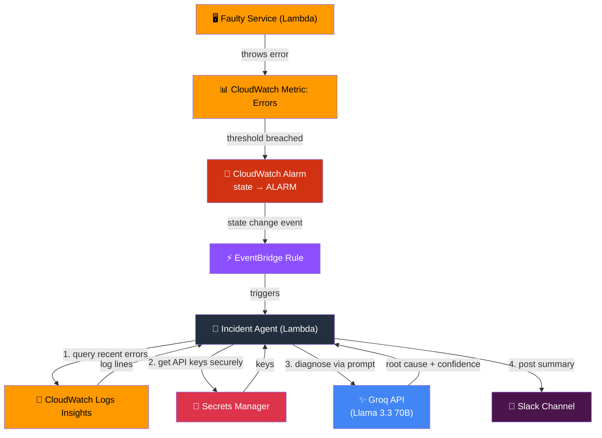
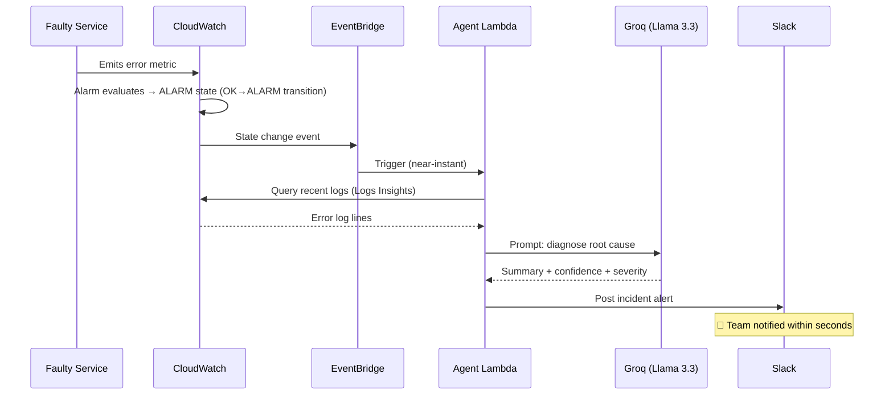

# 🚨 Autonomous Infrastructure Monitoring Agent


-4285F4)


> An event-driven AI agent that watches for AWS infrastructure failures, investigates them by querying CloudWatch Logs, diagnoses the likely root cause using an LLM, and posts a human-readable incident summary to Slack — automatically, with no human digging through logs first.

---

## 🎯 What It Does

1. A **CloudWatch Alarm** trips the moment an error metric crosses a threshold
2. **EventBridge** catches that state change instantly (event-driven, not polling)
3. A **Lambda function** pulls the last few minutes of relevant error logs via **CloudWatch Logs Insights**
4. Those logs are handed to **Groq (Llama 3.3 70B)** with a structured prompt asking it to diagnose *what broke*, *why*, and *how confident* it is
5. The AI-generated incident summary is posted to **Slack** in real time

---

## 🔀 Architecture



### Sequence view



---

## 🧰 Tech Stack

| Layer | Service / Tool | Purpose |
|---|---|---|
| Compute | AWS Lambda | Runs the faulty service + the agent logic |
| Monitoring | Amazon CloudWatch | Metrics, Alarms, Logs Insights |
| Event Routing | Amazon EventBridge | Event-driven trigger (no polling) |
| Secrets | AWS Secrets Manager | Securely stores API keys/webhook URL |
| AI Reasoning | Groq API (Llama 3.3 70B) | Fast, free-tier LLM for log diagnosis |
| Notifications | Slack Incoming Webhooks | Real-time alerting |
| IAM | AWS IAM | Least-privilege roles per function |

---

## 📁 Folder Structure

```
monitoring-agent/
│
├── README.md
├── faulty-service/
│   └── index.py                # Simulated failing service (30% error rate)
├── agent-lambda/
│   └── index.py                # The agent: logs → LLM → Slack
├── iam/
│   ├── lambda-trust-policy.json
│   └── agent-permissions-policy.json
├── event-pattern.json           # EventBridge rule pattern
└── demo/
    └── trigger_incident.ps1     # Forces failures + tails live logs
```

---

## ✅ Prerequisites

- [ ] AWS account with IAM user + access keys configured (`aws configure`)
- [ ] Free API key from [Groq Console](https://console.groq.com)
- [ ] A Slack workspace you can add a webhook to

---

## ⚙️ Setup Guide

### 1. Slack Webhook
`api.slack.com/apps` → **Create New App** → **From scratch** → **Incoming Webhooks** → toggle **ON** → **Add New Webhook to Workspace** → pick a channel → copy the URL.

### 2. Groq API Key
`console.groq.com` → **API Keys** → **Create API Key**

### 3. Store secrets
```powershell
aws secretsmanager create-secret --name monitoring-agent/groq-key --secret-string "YOUR_GROQ_KEY"
aws secretsmanager create-secret --name monitoring-agent/slack-webhook --secret-string "YOUR_SLACK_WEBHOOK_URL"
```

### 4. Create IAM roles
```powershell
aws iam create-role --role-name lambda-basic-execution --assume-role-policy-document file://iam/lambda-trust-policy.json
aws iam attach-role-policy --role-name lambda-basic-execution --policy-arn arn:aws:iam::aws:policy/service-role/AWSLambdaBasicExecutionRole

aws iam create-role --role-name incident-agent-role --assume-role-policy-document file://iam/lambda-trust-policy.json
aws iam attach-role-policy --role-name incident-agent-role --policy-arn arn:aws:iam::aws:policy/service-role/AWSLambdaBasicExecutionRole
aws iam put-role-policy --role-name incident-agent-role --policy-name agent-permissions --policy-document file://iam/agent-permissions-policy.json
```

### 5. Deploy both Lambdas
```powershell
$ACCOUNT_ID = (aws sts get-caller-identity --query Account --output text)

cd faulty-service
Compress-Archive -Path index.py -DestinationPath function.zip -Force
cd ..
aws lambda create-function --function-name faulty-order-service `
  --runtime python3.12 --role arn:aws:iam::${ACCOUNT_ID}:role/lambda-basic-execution `
  --handler index.handler --zip-file fileb://faulty-service/function.zip

cd agent-lambda
Compress-Archive -Path index.py -DestinationPath function.zip -Force
cd ..
aws lambda create-function --function-name incident-agent `
  --runtime python3.12 --role arn:aws:iam::${ACCOUNT_ID}:role/incident-agent-role `
  --handler index.handler --timeout 30 --zip-file fileb://agent-lambda/function.zip
```

### 6. Create the CloudWatch alarm
```powershell
aws cloudwatch put-metric-alarm --alarm-name faulty-order-service-errors `
  --namespace AWS/Lambda --metric-name Errors `
  --dimensions Name=FunctionName,Value=faulty-order-service `
  --statistic Sum --period 60 --evaluation-periods 1 `
  --threshold 1 --comparison-operator GreaterThanOrEqualToThreshold `
  --treat-missing-data notBreaching
```

### 7. Wire EventBridge
```powershell
aws events put-rule --name trigger-incident-agent --event-pattern file://event-pattern.json

$REGION = (aws configure get region)
aws lambda add-permission --function-name incident-agent `
  --statement-id eventbridge-invoke --action lambda:InvokeFunction `
  --principal events.amazonaws.com `
  --source-arn arn:aws:events:${REGION}:${ACCOUNT_ID}:rule/trigger-incident-agent

aws events put-targets --rule trigger-incident-agent `
  --targets "Id=1,Arn=arn:aws:lambda:${REGION}:${ACCOUNT_ID}:function:incident-agent"
```

---

## 🚀 Running the Demo

```powershell
for ($i=1; $i -le 15; $i++) {
    aws lambda invoke --function-name faulty-order-service out.json
    Start-Sleep -Seconds 1
}
aws cloudwatch describe-alarms --alarm-names faulty-order-service-errors --query 'MetricAlarms[0].StateValue' --output text
aws logs tail /aws/lambda/incident-agent --follow
```

Check Slack — an alert should arrive within seconds of the alarm state changing to `ALARM`.

> **Note:** EventBridge only fires on an actual `OK → ALARM` state *transition*, not on every re-evaluation while already in `ALARM`. To retest, reset the alarm first:
> ```powershell
> aws cloudwatch set-alarm-state --alarm-name faulty-order-service-errors --state-value OK --state-reason "reset for testing"
> ```

---

## 📤 Sample Output

```
🚨 Incident Alert: faulty-order-service-errors

The order service is experiencing errors.
LIKELY CAUSE: Simulated database connection timeout.
CONFIDENCE: High
SEVERITY: Medium
```

---

## 🐛 Real Issues Hit While Building This (and how they were solved)

| Issue | Root Cause | Fix |
|---|---|---|
| `EntityAlreadyExists` on IAM role creation | Role already existed from a prior attempt | Harmless — ignored and continued |
| `InvalidEventPatternException` | PowerShell's `Out-File`/here-strings add a UTF-8 **BOM** that breaks AWS's JSON parser | Wrote the file via Python (`json.dump`) or `[System.IO.File]::WriteAllText` with explicit ASCII encoding — no BOM |
| Slack webhook `invalid_token` | Old webhook had expired/been revoked | Created a fresh Incoming Webhook and updated the secret via `put-secret-value` |
| Groq call failed with `HTTP Error 403: Forbidden` **only from inside Lambda** (worked fine locally) | Groq sits behind Cloudflare, which blocks Python's default `urllib` User-Agent as bot-like traffic | Added an explicit `User-Agent` header to the request |
| No Slack message on a retest | CloudWatch Alarm State Change events only fire on an actual `OK→ALARM` **transition**, not on repeated evaluations while already in `ALARM` | Manually reset the alarm to `OK` between test runs using `set-alarm-state` |
| `curl` commands failing with parameter binding errors on Windows | PowerShell's `curl` is an alias for `Invoke-WebRequest`, which uses different syntax than real curl | Used `Invoke-RestMethod` with native PowerShell hashtable headers instead |

---

## 💰 Cost Breakdown

| Resource | Free Tier | Cost |
|---|---|---|
| Lambda | 1M requests + 400K GB-s/month | $0 |
| CloudWatch Alarms | 10 alarms free | $0 |
| CloudWatch Logs | 5 GB ingestion free | $0 |
| EventBridge | 1M events free | $0 |
| Secrets Manager | ~$0.40/secret/month | ~$0.80/mo |
| Groq API | Free tier | $0 |
| Slack Webhooks | Always free | $0 |

**Total: under $1/month**, easily covered even without AWS credits.

---

## 🧹 Cleanup

```powershell
aws lambda delete-function --function-name faulty-order-service
aws lambda delete-function --function-name incident-agent
aws cloudwatch delete-alarms --alarm-names faulty-order-service-errors
aws events remove-targets --rule trigger-incident-agent --ids "1"
aws events delete-rule --name trigger-incident-agent
aws secretsmanager delete-secret --secret-id monitoring-agent/groq-key --force-delete-without-recovery
aws secretsmanager delete-secret --secret-id monitoring-agent/slack-webhook --force-delete-without-recovery
```

---

## 🔮 Future Improvements

- [ ] DynamoDB-backed cooldown to prevent alert spam from flapping alarms
- [ ] Migrate from raw AWS CLI to **AWS CDK** for reproducible infrastructure
- [ ] Auto-create Jira/GitHub tickets for high-confidence incidents
- [ ] Add a second Action Group that checks recent deployments for correlation
- [ ] Multi-alarm support across several monitored services

---

<p align="center">Built as a hands-on project in event-driven AWS architecture and AI agent design.</p>
